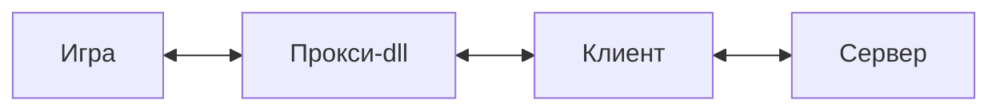
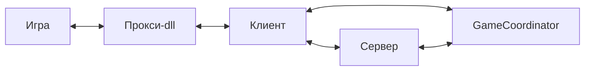

```
//==== PleaseRetryEmu / Copyright (C) 2026, dmitriykotik. MIT License. ========//
// This documentation is part of PleaseRetryEmu, an open-source project.
// This Software and documentation are provided strictly "AS IS", without
// warranty of any kind, express or implied.
//
// LEGAL NOTICE: This project is an independent compatibility layer and is NOT
// affiliated with, endorsed, or authorized by Valve Corporation. "Steam" and
// "Steamworks" are registered trademarks of Valve Corporation.
//
// Developed strictly for EDUCATIONAL, RESEARCH, and software preservation
// purposes. The author holds NO LIABILITY for any misuse, legal consequences,
// or third-party restrictions. All actions are performed at your own risk.
//=============================================================================//
```

# Введение
Добро пожаловать!\
Что-ж, если вы здесь, значит вам нужна информация, которая касается `PleaseRetryEmu`...\
Весь проект и документация была написана мной, поэтому любая его часть может содержать ошибки. Сама же документация написана в более разговорном стиле, чем официальном. Я хочу поделиться своим опытом разработки и предоставить другим разработчикам информацию, которую не так уж и легко найти на просторах интернета.

Давайте знакомиться. Я `dmitriykotik`. Пока что, это всё, что вам нужно знать.\
Вы уже заметили 13 строк комментария? Не переживайте, вы её будете видеть на каждой странице. `PleaseRetryEmu` - юридически спорный проект. Думаю, вы это поймёте по ходу чтения документации. 

### Что такое `PleaseRetryEmu`?
`PleaseRetryEmu` - это комплексное программное обеспечение для эмуляции работы Steam. Сам комплекс разбит на 3 части: прокси-dll, клиент и сервер. 
- `Прокси-dll` - библиотека, которая работает по принципу библиотеки `steam_api.dll`. Сама dll либо заменяет оригинальную библиотеку `steam_api`, либо инъецируется прямиком в программу. Библиотека за счёт `клиента`.
- `Клиент` - это посредник, между `прокси-dll` и `сервером`. `Клиент` может работать автономно, либо за счёт данных от сервера.
- `Сервер` - это, как неудивительно, сервер, который обменивается данными с подключёнными клиентами. Сервер хранит у себя данные о пользователях, инвентарях и другие ресурсы. Он же и передаёт эти данные клиентам. 


Между тем, есть ещё и 4 часть, которая называется: `GameCoordinator` - это отдельный сервер отвечающий за координацию игровых данных. 


Насколько я понял, эмуляторы, по типу `SmartSteamEmu` и `GoldbergEmu`, содержат в себе универсальный координатор, который отвечает на базовые запросы, например, `Дай мне информацию об инвентаре`.

### Зачем?
_Готовьтесь, тут будет душно._

Теперь стоит расcказать больше о причинах создания проекта. Приорbтетной задачей эмулятора для меня - это запуск CS:GO старых лет, например, 2018 года. Мне бы хотелось реализовать настоящий матчмекинг в игре, которая больше не поддерживается Steam уже давно. Так в чём проблема использовать эмуляторы `SmartSteamEmu`, `GoldbergEmu` или `RevEmu` из `7Launcher`? Оказалось не всё так просто. `SmartSteamEmu`, при подключении второго клиента, блокирует игру одного из клиентов (На клиенте выводится сообщение о том, что у него не куплена игра). Самое главное `GameCoordinator`: я написал плагин для `SSE` (_сокращённо от SmartSteamEmu_), который перенаправлял все запросы `GameCoordinator` на мой сервер. Этот вариант сработал, только, по какой-то причине, `SSE` брал на себя весь матчмейкинг, поэтому этот вариант тоже перестал подходить. Отксюда и появилось название `PleaseRetry`. Проект с `GameCoordinator` и плагином опубликован у меня в репозиториях GitHub. Вы не думайте, что я косой, хотя так, возможно, и есть. Я перепробовал все конфигурации `SSE` и нашёл гайд от школьника на YouTube. На моё удивление - это не помогло. 

Однако, я не оставил попытки найти готовое решение. Я попробовал `GoldbergEmu` - мне не понравилось. Тем более проект у меня не компилировался, ибо эмулятор также забирал себе работу `GameCoordinator`. О `RevEmu` от `7Launcher` я вообще молчу. Я смог скачать инсталлер патча и распаковаnm его. Однако ничего полезного это не дало. Поэтому я пришёл к фразе "_Проще самому сделать эмулятор_".

Очень душевная история, которую стоит забыть. 